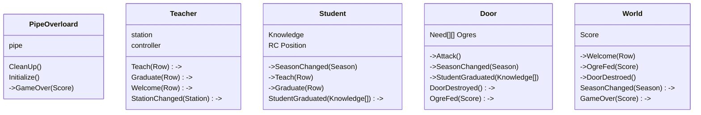

Event sourcing

Mermaid graph

```mermaid
classDiagram
    class PipeOverloard{
        pipe
        CleanUp()
        Initialize()
        ->GameOver(Score)
    }
    class Teacher{
        station
        controller
        Teach(Row)->
        Graduate(Row)->
        Welcome(Row)->
        StationChanged(Station)->
    }
    class Student{
        Knowledge
        RC Position
        ->SeasonChanged(Season)
        ->Teach(Row)
        ->Graduate(Row)
        StudentGraduated(Knowledge[])->
    }
    class Door{
        Need[][] Ogres
        ->Attack()
        ->SeasonChanged(Season)
        ->StudentGraduated(Knowledge[])
        DoorDestroyed()->
        OgreFed(Score)->
    }
    class World{
        Score
        ->Welcome(Row)
        ->OgreFed(Score)
        ->DoorDestroed()
        SeasonChanged(Season)->
        GameOver(Score)->
    }
```