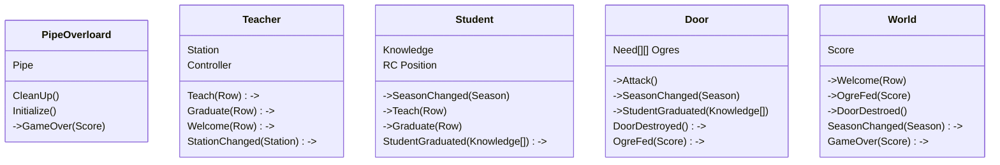

Event sourcing

Mermaid graph


Second version more complex
```mermaid
classDiagram
	class PipeOverloard{
		Pipe
		Leaderboard
		CleanUp()
		Initialize()
		->GameOver(Score)
	}
	class Teacher{
		Station
		Controller
		Teach(Row)->
		Graduate(Row)->
		Welcome(Row)->
		StationChanged(Station)->
		SeeThrough()->
		Cook()->
		Repair()->
	}
	class Student{
		Knowledge
		RC Position
		->SeasonChanged(Season)
		->Teach(Row)
		->Graduate(Row)
		StudentGraduated(Knowledge[])->
	}
	class Door{
		Need[][] Ogres
		->Attack()
		->SeasonChanged(Season)
		->StudentGraduated(Knowledge[])
		->Repair()
		->SeeThrough()
		DoorDestroyed()->
		OgreFed(Score)->
	}
	class Kitchen{
		Stock
		->Cook()
		->SeasonChanged(Season)
		FoodDepleted()->
	}
	class World{
		Score
		->Welcome(Row)
		->OgreFed(Score)
		->DoorDestroed()
		->FoodDepleted()
		SeasonChanged(Season)->
		GameOver(Score)->
	}
	```
